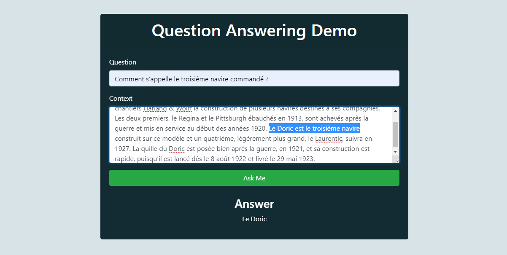

Fine-tuning CamemBERT on a subset of FQuAD dataset for Question Answering
==============================

This repository contains code for a fine-tuning experiment of [CamemBERT](https://camembert-model.fr/), a French version of the BERT language model, on a portion of the [FQuAD](https://fquad.illuin.tech/) (French Question Answering Dataset) for Question Answering tasks.

### Dataset
The FQuAD dataset is a collection of questions and answers in French. It contains over 25,000 question-answer pairs and covers a wide range of topics, including history, science, and literature. 

The CamemBERT model was fine-tuned on this dataset to create a French question-answering system. Due to the high computation requirements of the fine-tuning process, a CUDA-enabled GPU was used to train the model for 10 epochs on a subset of the dataset containing ~4,500 question-answer pairs. 

### Requirements 
- Python 3.10
- CUDA-enabled GPU
- CUDA 11.7 (Download from [here](https://developer.nvidia.com/cuda-11-7-0-download-archive?target_os=Windows&target_arch=x86_64&target_version=11&target_type=exe_local))
- Torch 2.0.0 

Install Torch + CUDA 11.7 after creating/activating a virtual environment:
```bash
  pip install torch==2.0.0+cu117 -f https://download.pytorch.org/whl/cu117/torch_stable.html 
```
*Note:* ~2.3Gb will be downloaded. 

Install the required Python packages using pip:
```bash
  pip install -r requirements.txt
```

### Prepare datasets
To prepare and split the data stored at "data/raw/", run the make_dataset.py script
```bash
  python src/make_dataset.py -i data.json
```

### Fine-tuning
To fine-tune CamemBERT on a portion of the FQuAD dataset, run the train.py script:

```bash
  python src/train.py
```

The train.py script loads the dataset, prepares it for training, and fine-tunes the CamemBERT model. The trained model is saved to the models/ directory.

### Evaluate

The evaluation of the model is saved in a bit messy way. Results are saved in results.json in the root level of the repo. Other evaluations during training can be found at "/models/". Will be fixed in the future.

### Inference
To use the trained model for inference on new question-answer pairs, run the predict.py script:

```bash
  python src/predict.py --question "A question" --context "A context"
```

The predict.py script loads the saved model from the models/ directory and uses it to answer the provided question in the given context.

Example: 
```bash
   python src/predict.py --question "Comment s'appelle le troisième navire commandé ?" --context "Avant la Première Guerre mondiale, l'International Mercantile Marine Co. commande aux chantiers Harland & Wolff la construction de plusieurs navires destinés à ses compagnies. Les deux premiers, le Regina et le Pittsburgh ébauchés en 1913, sont achevés après la guerre et mis en service au début des années 1920. Le Doric est le troisième navire construit sur ce modèle et un quatrième, légèrement plus grand, le Laurentic, suivra en 1927. La quille du Doric est posée bien après la guerre, en 1921, et sa construction est rapide, puisqu'il est lancé dès le 8 août 1922 et livré le 29 mai 1923."
```

```bash
Output: Answer: Le Doric
```

### Demo

The fine-tuned CamemBERT model was deployed using FastAPI. You can try the demo by running app.py
```bash
  python demo/app.py
```
Once the server is running, open a web browser and go to [http://127.0.0.1:8000](http://127.0.0.1:8000)



### References 

FQuAD: French Question Answering Dataset - 2020arXiv200206071

